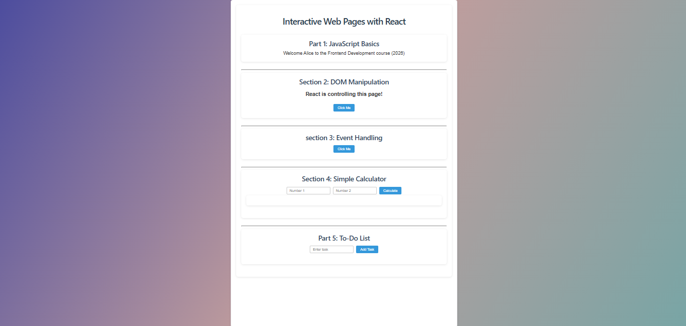

Assignment: Building Interactive Web Pages with React

# Objective

This assignment demonstrates how React is used to build interactive web pages.
Students implement small interactive features and learn core React concepts such as components, state, props, and event handling.

# Technologies Used

-React (Vite or Create React App)
-JavaScript
-CSS
📂 Project Structure
/project-folder
│── src/
│ │── App.jsx
│ │── components/
│ │ │── Welcome.jsx
│ │ │── DomChange.jsx
│ │ │── EventDemo.jsx
│ │ │── Calculator.jsx
│ │ │── Todo.jsx
│ │── App.css
│── index.html
│── package.json
│── screenshots/

# Features

# Part 1: React Basics (Variables & Console Output)

Declared variables for:
Student name
Course name
Year
Displayed a welcome message in the browser console using React component logic.

Example Console Output:

Welcome Alice to the Frontend Development course.

# Part 2: State & Dynamic Text (DOM Manipulation in React)

A heading and a button are rendered using React.
When the button is clicked, the heading text changes using React state.

Before Click:

Welcome to my website

After Click:

JavaScript is controlling this page!

Implemented using useState() instead of document.getElementById().

# Part 3: Event Handling in React

A button and a paragraph are displayed.
Used React’s onClick event to update the paragraph text.

Output:

You clicked the button!

# Part 4: Simple Calculator Component

Accepts two numbers from the user using input fields.
Displays:
Addition
Subtraction
Multiplication
Division
Implemented using React state and functions.

Example:

Number 1: 10
Number 2: 5
Addition = 15
Subtraction = 5
Multiplication = 50
Division = 2

# Part 5: Mini Project – To-Do List

A small task manager built as a React component where users can:

Add tasks
Display tasks
Remove tasks
Interface Example:

Tasks:

- Study React
- Finish assignment
- Practice coding
  How to Run the Project
  1️ Install dependencies
  npm install
  2️⃣ Start the development server
  npm run dev
  3️⃣ Open in browser

Visit the local server shown in the terminal (usually http://localhost:5173).

Screenshots

Screenshots of the working application are included in the screenshots folder.

# Evaluation Criteria

Criteria Marks
Correct React logic 30
State & DOM updates 20
Event handling 20
Mini project functionality 20
Code organization 10
Total 100

# Student Information

Student Name:MUNYAWERA Anaclet
Reg Number:25RP00508
Courses Name: Front End Development

---------------------------------END-------------------------------------
